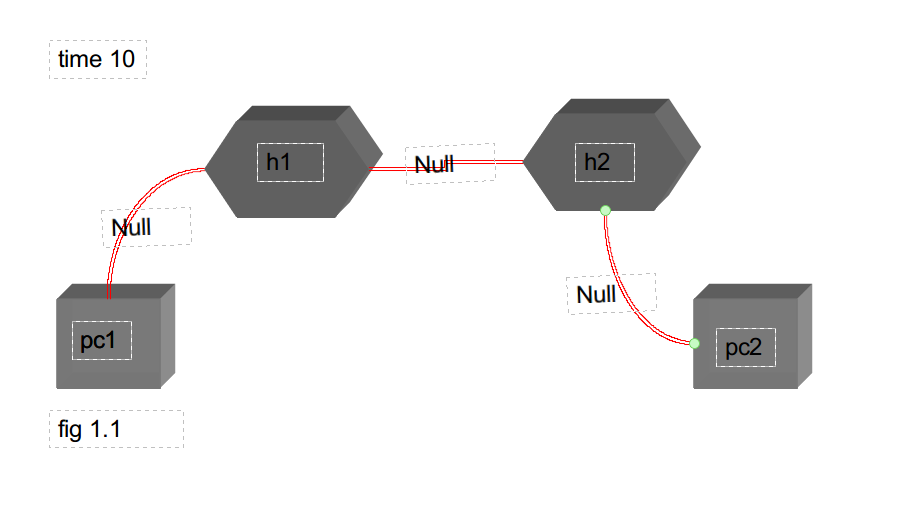
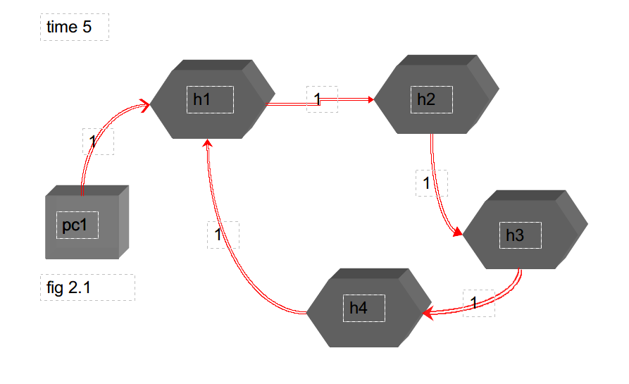

# 
Proyecto de Redes Capa fisica

### 
David Orlando De Quesada Oliva C311

### 
Javier Dominguez C312

## Como ejecutar el proyecto:
# python main.py -f file.txt

## Estructuracion de proyecto:
#### En el archivo file.txt se copian las instrucciones con las que va a  simular la red

#### Asumimos que cada instruccion viene en orden . Si en el time i llego la instruccion j entonces toda instruccion j+1 tiene que llegar en un time >= i.

#### El tiempo que un bit va a estar siendo transmitido por un host es de 3ms por default. Esto puede cambiarse en el main.py dandole a slot_time otro valor.
#### Cada file que se cree de un device host se guarda en ./Hosts y cada file de un device hub se guarda en ./Hubs.

#### en myParser.py se analizara la sintaxis de cada linea en dependecia del comando a ejecutar para verificar si llega de la forma esperada luego  se ejecuta en device_handler.py

#### en device_handler hay 4 metodos fundamentales que son los que se van a encargar de ejecutar cada instruccion
#### create_pc: se va a ejecutar cuando haya que crear un host
#### create_hub: se va a ejecutar cuando haya que crear un hub 
#### setup_connection: se va ejecutar cuanda haya una instruccion connect
#### shutdown_connection: se va a ejecutar cuando haya una instruccion disconnect
#### Siempre antes de cada ejecutar una insuccion se actualiza la condicion de la red. Para esto se realiza un recorrido solo por los host mientras el time sea menor que el de la instruccion verificando quien esta transmitiendo quien esta parado producto de una colision y ya puede transmitir etc.

#### Los Host se representan con la class Host . Cada Host tiene un puerto que se representa con la class Port y a su vez un port puede tener o no un cable que se representa con la propiedad cable. La instancia de un cable es la misma para los dos puertos que se conectan a travez de el. Un puerto se dice que no esta libre si tiene una instancia de cable en el. Un Host tiene una propiedad data que contiene la cadena de bits que tendria que transmitir y una cola data_pending donde se van almacenando proximas cadenas de bits que pueden ir llegando en el mismo instante. La propiedad bit_sending identifica el bit a transmitir inmediatamente que se pueda, la propiedd transmitting dice si un host esta o no transmitiendo informacion , la propiedad stopped dice si ese host fue parado producto de una transmision fallida por colision y segun el protocolo debe esperar un tiempo para poder volvera intentar enviar ese bit que fallo, la propiedad stopped_time permite saber que tiempo le queda al host antes de poder volver a intentar una transmision, la propiedad transmitting time dice cuanto tiempo ha estado en transmision la informacion. 

#### Los Hubs se reprensentan con la class Hub . Cada Hub tiene varios puertos . Cada uno de esos puertos se representa con la class Port igual que en los Host. Un Hub tiene la propiedad bit_sending que identifica si el esta retransmitiendo la informacion transmitido por un host. 

#### Un cable tiene la propiedad transfer_port con la cual sabe a traves de que puerto le esta llegando la informacion que transmite a otro puerto.

#### Un puerto tiene la propiedad device para saber a que device pertence ese puerto

#### Un diccionario  connections de key = port1.name val= port2.name representa todas las conexiones que van teniendo lugar. Este dicc se va actualizando con cada connect o disconnect.

#### Un dicc ports representa todos los puertos que hay en la red de forma tal que si quiero tener la instancia de un puerto x solo tengo que hacer ports[x].
 
## Protocolo de colisiones:
#### Para detectar las colisiones un host lee en caso que tenga un cable conectado a el. Si la lectura que hace del cable da distinto de Null es porque se esta transmitiendo informacion por ese cable y por tanto se produce una colision. Al producirse una colision se mantiene la informacion que se estaba mandando por el canal y el host entra en un estado que se le llamo stopped luego que se definiera un tiempo aleatorio el cual aumenta de rango en cada intento fallido. Se decidio tener un maximo de intentos fallidos fijado en 16 luego del cual se decide perder la informacion . En el caso que un host intente enviar una informacion y este no tiene un cable conectado a su puerto y este intenta realizar una transmision se ve como una colision pues tampoco pudo enviar informacion y se aplica lo mismo que se aplico anteriormente. Un host que su envio tuve colision pasa a un  estado stopped.

## Explicacion  en algunos ejemplos como se comportaria el programa

#### Como se aprecia en la fig1.1 tengo dos host transmitiendo informacion a dos hubs distintos en el ms 10. Si en ese mismo intante de tiempo procedo a conectar los dos hubs quedaria : 

#### Al conectar un puerto de h1 con un puerto de h2 como en ese mismo instante de tiempo habían dos host transmitiendo se debe producir una colisión para eso se envía  una señal a los dos host para que dejen de enviar información y se le aplica el protocolo de colisiones por lo que cada host podrá hacer de nuevo un intento de conexión al cabo del tiempo random que se le haya sido asignado. Al dejarse de transmitir información los cables deben de tener solo Null en su lectura.

#### Como se aprecia en el siguiente ejemplo un host va a estar enviando informacion el cual esta conectado a otro hub y este a su vez a otro y asi hasta forma un ciclo con el primer hub.

#### Para que no se caiga en un ciclo infinito similar a como se hace con DFS se tiene una lista donde se guardan todos los devices que hayan sido visitados mientras se esta regando la informacion por la red de esta forma al caer en el mismo hub paro.

#####

