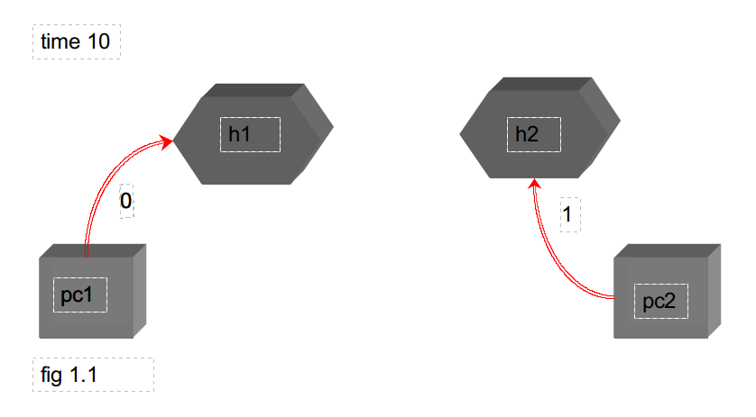

# 
Proyecto de Redes Capa fisica

### 
David Orlando De Quesada Oliva C311

### 
Javier Dominguez C312

## Como ejecutar el proyecto:
# python main.py -f file.txt

## Estructuracion de proyecto:
#### En el archivo file.txt se copian las instrucciones con las que va a  simular la red

#### Asumimos que cada instruccion viene en orden . Si en el time i llego la instruccion j entonces toda instruccion j+1 tiene que llegar en un time >= i.

#### El tiempo que un bit va a estar siendo transmitido por un host es de 3ms por default. Esto puede cambiarse en el main.py dandole a slot_time otro valor.
#### Cada file que se cree de un device host se guarda en ./Hosts y cada file de un device hub se guarda en ./Hubs.

#### en myParser.py se analizara la sintaxis de cada linea en dependecia del comando a ejecutar para verificar si llega de la forma esperada luego  se ejecuta en device_handler.py

#### en device_handler hay 4 metodos fundamentales que son los que se van a encargar de ejecutar cada instruccion
#### create_pc: se va a ejecutar cuando haya que crear un host
#### create_hub: se va a ejecutar cuando haya que crear un hub 
#### setup_connection: se va ejecutar cuanda haya una instruccion connect
#### shutdown_connection: se va a ejecutar cuando haya una instruccion disconnect
#### Siempre antes de cada ejecutar una insuccion se actualiza la condicion de la red. Para esto se realiza un recorrido solo por los host mientras el time sea menor que el de la instruccion verificando quien esta transmitiendo quien esta parado producto de una colision y ya puede transmitir etc.

#### Los Host se representan con la class Host . Cada Host tiene un puerto que se representa con la class Port y a su vez un port puede tener o no un cable que se representa con la propiedad cable. La instancia de un cable es la misma para los dos puertos que se conectan a travez de el. Un puerto se dice que no esta libre si tiene una instancia de cable en el. Un Host tiene una propiedad data que contiene la cadena de bits que tendria que transmitir y una cola data_pending donde se van almacenando proximas cadenas de bits que pueden ir llegando en el mismo instante. La propiedad bit_sending identifica el bit a transmitir inmediatamente que se pueda, la propiedd transmitting dice si un host esta o no transmitiendo informacion , la propiedad stopped dice si ese host fue parado producto de una transmision fallida por colision y segun el protocolo debe esperar un tiempo para poder volvera intentar enviar ese bit que fallo, la propiedad stopped_time permite saber que tiempo le queda al host antes de poder volver a intentar una transmision, la propiedad transmitting time dice cuanto tiempo ha estado en transmision la informacion. 

#### Los Hubs se reprensentan con la class Hub . Cada Hub tiene varios puertos . Cada uno de esos puertos se representa con la class Port igual que en los Host. Un Hub tiene la propiedad bit_sending que identifica si el esta retransmitiendo la informacion transmitido por un host. 

#### Un cable tiene la propiedad transfer_port con la cual sabe a traves de que puerto le esta llegando la informacion que transmite a otro puerto.

#### Un puerto tiene la propiedad device para saber a que device pertence ese puerto

#### Un diccionario  connections de key = port1.name val= port2.name representa todas las conexiones que van teniendo lugar. Este dicc se va actualizando con cada connect o disconnect.

#### Un dicc ports representa todos los puertos que hay en la red de forma tal que si quiero tener la instancia de un puerto x solo tengo que hacer ports[x].
 
## Protocolo de colisiones:
#### Para detectar las colisiones un host lee en caso que tenga un cable conectado a el. Si la lectura que hace del cable da distinto de Null es porque se esta transmitiendo informacion por ese cable y por tanto se produce una colision. Al producirse una colision se mantiene la informacion que se estaba mandando por el canal y el host entra en un estado que se le llamo stopped luego que se definiera un tiempo aleatorio el cual aumenta de rango en cada intento fallido. Se decidio tener un maximo de intentos fallidos fijado en 16 luego del cual se decide perder la informacion . En el caso que un host intente enviar una 

##### De la forma en que decidimos modelar el proyecto consideramos hacer las colisiones de la siguiente manera:
##### Si el host va a enviar un bit de informacion y el no esta conectado a nadie entonces se entiende como un  intento fallido y se hace lo mismo que si hubiera una colision por estar el cable transmitiendo otro bit de informacion en en ese instante. Al detectar una colision procedemos a lo siguiente el host no transmite la informacion y decide en ponerse estado stopped dentre de un tiempo aleatorio el cual aumenta de rango en cada  intento fallido de poner ese bit a transmitir. Decidimos tener un maximo de 16 intentos fallidos luego de los cuales ese bit se pierde y no llega a transmitirse. Para modelar los host y los hust tenemos dos class Hub y Host que sirven para modelar estos objetos. la class Host tiene una propiedad port que representa el unico puerto que tiene un host port tambien esta representado como una class Port la cual tiene la propiedad cable que permite conocer si hay un cable conectado o no cable esta tambien representado por una class Cable la cual contiene. Un host siempre escucha antes de empezar a transmitir si al escuchar por el cable se esta transmitiendo informacion que  el mismo esta recibiendo entonces se produce una colision y se aplica el protocolo explicado previamente. En caso que por una desconexion conexion en medio de una transmision de dos o mas host se unan todas estas sennales a traves de un hub se manda una sennal a los host para que paren de mandar informacion y se le aplica el protocolo a estos. De la forma que esta pensado un host sabe si esta transmitiendo o esta interrumpido sin posibilidad de enviar informacion hasta que pasa el tiempo requerido de estado interrumpido. Puede darse el caso que se mande un send a un host que esta interrumpido en dicho caso la informacion se intenta mandar y al no tener un cable para el envio funciona como una colision aplico el protocolo y vuelvo a intentar luego de una cantidad random de tiempo. Todo cable sabe en caso que se este transmitiendo informacion desde que puerto proviene esto permite  en caso de una desconexion  saber que parte de la red fue la que perdio la informacion que se estaba transmitiendo en ese instante y mandar a poner todos los cables que pertenecen a la misma en Null. Para saber las conexiones se dispone de un diccionario conexions con el cual se sabe si en puerto esta conectado y con quien esta conectado en caso que lo este. En una lista guardamos cada host que se crea ms a ms y para actualizar el estado de la red recorremos esa lista constantemente para comprobar si un host esta transmitiendo o esta parado producto de una colision y del protocolo que aplicamos . Si luego de un recorrido por todos los hosts ninguno esta transmitiendo o esta esperando a transmitir producto de una colision entonces se puede decir que la red queda inactiva si no hay mas instrucciones por ejecutar.

#####
#####

